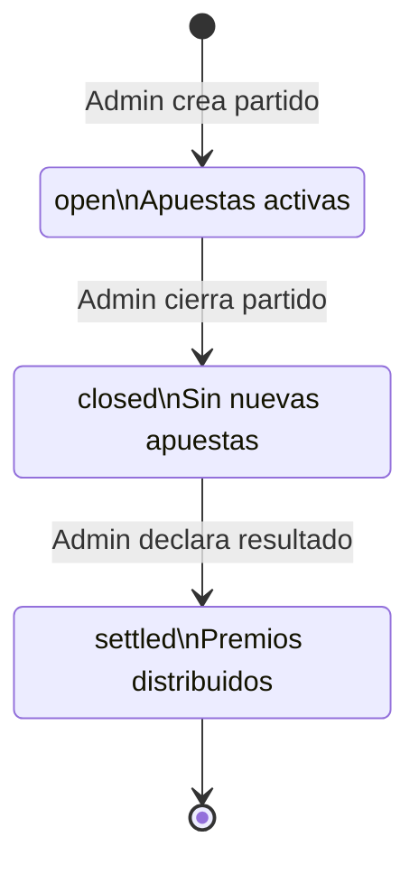
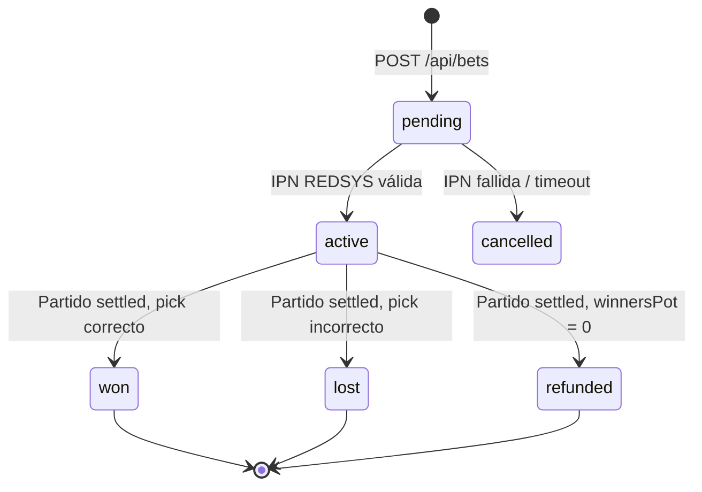
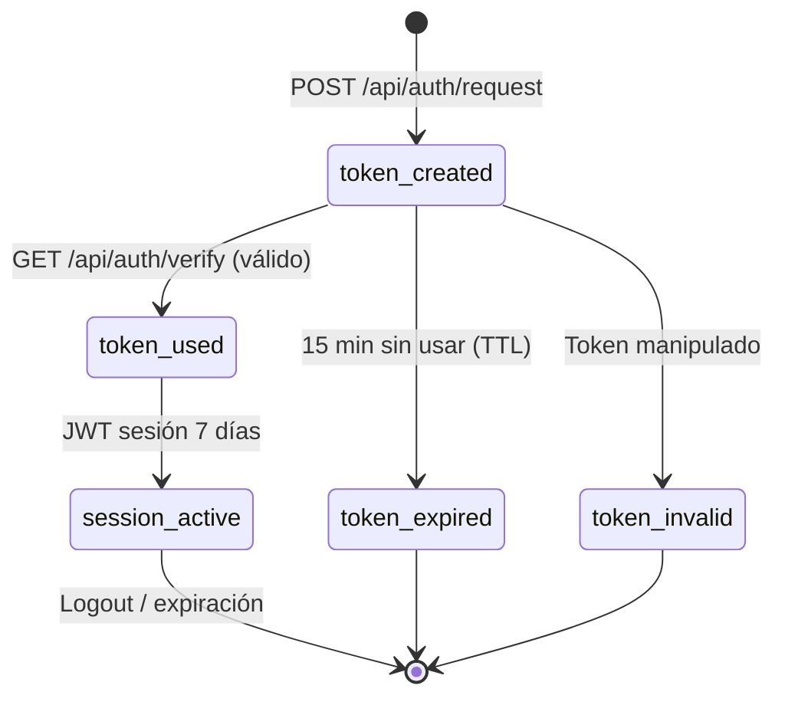

# Sistema de Apuestas Deportivas — Gambling App

Una **aplicación web full-stack con Next.js 16 / React 19 / TypeScript 5** que implementa una plataforma completa de apuestas deportivas con procesamiento de pagos reales mediante REDSYS, autenticación sin contraseña mediante magic links y distribución proporcional de premios entre ganadores.

---

## 1. Módulos Implementados

### 1.1 Autenticación Magic Link + JWT

Inicio de sesión sin contraseña mediante enlaces JWT firmados por correo electrónico. El usuario solicita un enlace en `/login`, lo recibe vía Mailhog (SMTP local), hace clic y obtiene un JWT de sesión de 7 días almacenado en `localStorage`. No se usan cookies.

- Token de magic link expira en 15 minutos; uso único mediante flag en MongoDB.
- JWT de sesión: `{ userId, email, role }`.
- Separación de roles `admin` / `user` aplicada en cada ruta de API.

### 1.2 Motor de Apuestas y Distribución de Premios

Los usuarios navegan partidos abiertos, eligen resultado (`team1` / `team2` / `draw`) y apuestan dinero real vía REDSYS TPV virtual (modo test).

- Ciclo de vida del partido: `open → closed → settled`.
- Algoritmo proporcional: el bote total se reparte entre ganadores según su participación relativa.
- Si no hay ganadores, todas las apuestas se reembolsan (`status: 'refunded'`).
- Todos los valores monetarios en **céntimos** (aritmética entera, `Math.floor`).

```
payout(bet) = (bet.amountCents / winnersPot) * totalPot
```

### 1.3 Integración de Pagos REDSYS

Formulario firmado HMAC-SHA256 enviado al TPV virtual REDSYS (entorno test), con validación de callback IPN.

- Genera un `redsysOrderId` único por apuesta (índice único en MongoDB).
- Endpoint IPN `POST /api/payments/notify` valida la firma del comercio antes de activar la apuesta.
- Redirige a `/payments/ok` o `/payments/ko` tras el flujo de pago.
- Toda la lógica criptográfica aislada en `lib/redsys.ts`.

---

## 2. Estructura del Proyecto

```
gambling/
├── app/
│   ├── page.tsx                         — Home: lista de partidos abiertos
│   ├── layout.tsx                       — Layout raíz con Navbar y tema oscuro
│   ├── globals.css                      — Estilos globales (tema oscuro, acento verde)
│   ├── login/page.tsx                   — Formulario de solicitud de magic link
│   ├── auth/verify/page.tsx             — Procesa token de URL, inicia sesión
│   ├── matches/[id]/page.tsx            — Detalle del partido + formulario de apuesta
│   ├── my-bets/page.tsx                 — Historial de apuestas y saldo del usuario
│   ├── payments/ok/page.tsx             — Confirmación de pago exitoso
│   ├── payments/ko/page.tsx             — Página de error de pago
│   ├── admin/
│   │   ├── page.tsx                     — Dashboard de administración
│   │   ├── matches/page.tsx             — Gestión de todos los partidos
│   │   ├── matches/new/page.tsx         — Crear nuevo partido
│   │   ├── matches/[id]/page.tsx        — Editar partido / declarar resultado
│   │   └── users/page.tsx              — Gestión de usuarios
│   └── api/
│       ├── auth/request/route.ts        — POST: generar y enviar magic link
│       ├── auth/verify/route.ts         — GET: validar token, devolver JWT de sesión
│       ├── matches/route.ts             — GET (listar) / POST (crear) partidos
│       ├── matches/[id]/route.ts        — PATCH: actualizar estado / declarar resultado
│       ├── bets/route.ts                — GET (historial) / POST (colocar apuesta + REDSYS)
│       ├── payments/notify/route.ts     — POST: IPN REDSYS con validación HMAC
│       └── admin/
│           ├── users/route.ts           — GET: listar todos los usuarios (admin)
│           └── reports/route.ts         — GET: resumen de apuestas y pagos
├── lib/
│   ├── types.ts                         — Interfaces TypeScript (Match, Bet, User, MagicToken)
│   ├── db.ts                            — Cliente MongoDB singleton
│   ├── auth.ts                          — Helpers JWT sign/verify
│   ├── mail.ts                          — Transporte Nodemailer + Mailhog
│   ├── payout.ts                        — Cálculo proporcional de premios (función pura)
│   └── redsys.ts                        — Constructor de formulario REDSYS HMAC-SHA256 + verificador IPN
├── components/
│   └── Navbar.tsx                       — Navegación responsiva con enlaces por rol
├── context/
│   └── AppContext.tsx                   — Contexto React para estado de sesión
├── scripts/
│   └── seed.ts                          — Seeder de BD (admin + 3 usuarios + 3 partidos + apuestas)
├── tests/
│   ├── unit/
│   │   ├── setup.ts                     — Variables de entorno para tests (setupFiles de Vitest)
│   │   └── lib/
│   │       ├── payout.test.ts           — 6 tests del algoritmo de distribución
│   │       ├── auth.test.ts             — 7 tests de JWT sign/verify
│   │       └── redsys.test.ts           — 7 tests de construcción HMAC e IPN
│   └── e2e/
│       ├── auth.spec.ts                 — Flujo completo magic link vía Mailhog
│       ├── bet-flow.spec.ts             — Login → partido → apuesta → REDSYS → confirmación
│       ├── admin-match.spec.ts          — Crear → cerrar → liquidar → verificar premios
│       └── my-bets.spec.ts             — Historial de apuestas y saldo actualizado
├── docs/
│   ├── architecture.md                  — 5 diagramas Mermaid del sistema
│   └── decisions/
│       ├── ADR-001-mongodb-singleton.md
│       ├── ADR-002-jwt-localstorage-no-cookies.md
│       └── ADR-003-proportional-payout.md
├── .github/workflows/ci-cd.yml          — GitHub Actions: lint → test → build → deploy
├── .gitlab-ci.yml                       — GitLab CI: 3 stages paralelos
├── Dockerfile                           — Multi-stage build (builder + runner node:20-alpine)
├── docker-compose.gambling.yml          — Servicio con Traefik + red miseia-net externa
├── vitest.config.ts                     — Configuración Vitest con setupFiles y coverage
├── playwright.config.ts                 — Configuración Playwright con webServer
├── next.config.ts                       — Next.js con output: 'standalone'
├── .env.example                         — Plantilla de variables de entorno (comprometida en git)
├── package.json                         — Scripts, dependencias y devDependencies
└── package-lock.json                    — Lockfile npm (comprometido en git)
```

---

## 3. Patrones de Diseño y Arquitectura

- **Singleton (cliente MongoDB)** — `lib/db.ts` exporta una instancia única de `MongoClient` reutilizada entre invocaciones serverless para evitar agotamiento de conexiones (ver ADR-001).
- **Rutas API estilo repositorio** — cada `route.ts` maneja un único recurso; la lógica de negocio se delega a helpers de `lib/`, manteniendo las rutas delgadas.
- **Patrón Strategy (payout)** — `lib/payout.ts` encapsula el algoritmo de distribución como función pura, independientemente testeable y reemplazable sin tocar la base de datos.
- **Context + localStorage** — `context/AppContext.tsx` contiene el JWT decodificado y lo expone a toda la app; sin estado de sesión en el servidor.
- **Validación HMAC** — `lib/redsys.ts` implementa el protocolo REDSYS HMAC-SHA256 como utilidad pura, aislando las preocupaciones criptográficas.

### 3.1 Dependencias Bloqueadas

El proyecto cuenta con lockfile comprometido en el repositorio, garantizando instalaciones reproducibles en cualquier entorno (CI/CD, producción, desarrollo):

```
package-lock.json    — npm lockfile (Node.js 20 / npm 10)
```

> **Nota:** El archivo `package-lock.json` está comprometido en el repositorio Git. Siempre usar `npm ci` en lugar de `npm install` en entornos automatizados para respetar las versiones exactas bloqueadas.

---

## 4. Cómo Funciona

1. Un usuario solicita un magic link → el servidor genera un JWT de corta duración y lo envía vía Mailhog → al hacer clic, se intercambia por un token de sesión de 7 días almacenado en `localStorage`.
2. El usuario elige un partido, selecciona su resultado y envía la apuesta → el servidor crea una apuesta `pending` y renderiza el formulario REDSYS → tras el pago, REDSYS hace un POST al IPN `/api/payments/notify` que valida el HMAC y activa la apuesta.
3. Cuando el administrador declara el resultado, el motor de premios ejecuta la distribución: las apuestas ganadoras reciben su proporción del bote total acreditada en `user.balanceCents`; si no hay ganadores, todos reciben reembolso.

```typescript
// lib/payout.ts — lógica central de distribución
export function calculatePayouts(
  bets: Pick<Bet, '_id' | 'userId' | 'pick' | 'amountCents'>[],
  result: 'team1' | 'team2' | 'draw'
): PayoutResult[] {
  const totalPot = bets.reduce((sum, b) => sum + b.amountCents, 0)
  const winnersPot = bets
    .filter((b) => b.pick === result)
    .reduce((sum, b) => sum + b.amountCents, 0)

  return bets.map((b) => {
    if (winnersPot === 0)
      return { betId: b._id, userId: b.userId, status: 'refunded', payoutCents: b.amountCents }
    if (b.pick === result)
      return { betId: b._id, userId: b.userId, status: 'won',
               payoutCents: Math.floor((b.amountCents / winnersPot) * totalPot) }
    return { betId: b._id, userId: b.userId, status: 'lost', payoutCents: 0 }
  })
}
```

---

## 5. Primeros Pasos

### Prerrequisitos

- Node.js 20+
- MongoDB corriendo localmente en el puerto `27017`
- Mailhog corriendo localmente (SMTP `1025`, UI `8025`)
- Docker (opcional, para Mailhog y despliegue)

### Clonar e Instalar

```bash
git clone https://github.com/Jorgeaapaz/MISEIA_1-4-180-gambling.git
cd MISEIA_1-4-180-gambling
npm ci
```

> Usar `npm ci` (no `npm install`) para instalar exactamente las versiones del `package-lock.json`.

### Variables de Entorno

```bash
cp .env.example .env.local
# Editar .env.local con tus valores
```

Ver `.env.example` para la lista completa de variables requeridas con descripciones.

### Poblar la Base de Datos

```bash
npm run seed
```

Crea:
- `admin@gambling.local` (rol: admin)
- `alice@gambling.local`, `bob@gambling.local`, `carol@gambling.local` (rol: user)
- 3 partidos: Real Madrid vs Barcelona (`open`), Atlético vs Sevilla (`settled`), PSG vs Bayern (`closed`)

### Servidor de Desarrollo

```bash
npm run dev
```

Abrir [http://localhost:3000](http://localhost:3000). Ver correos magic link en [http://localhost:8025](http://localhost:8025) (UI Mailhog).

---

## 6. Ejemplos de Funcionamiento

### Apuesta exitosa con distribución proporcional

```
Alice apuesta €10 por team1 (1000 céntimos)
Bob   apuesta €5  por team1 ( 500 céntimos)
Carol apuesta €15 por team2 (1500 céntimos)

→ Admin declara resultado: team1
→ totalPot   = 3000 céntimos
→ winnersPot = 1500 céntimos
→ payout Alice = floor((1000/1500) * 3000) = 2000 céntimos (€20.00) ✓
→ payout Bob   = floor((500/1500)  * 3000) = 1000 céntimos (€10.00) ✓
→ Carol = 0 (perdió) ✗
```

### Reembolso total (sin ganadores)

```
Alice apuesta €20 por empate
Bob   apuesta €10 por empate

→ Admin declara resultado: team1
→ winnersPot = 0 → todas las apuestas reembolsadas
→ Alice: status=refunded, payout=2000 céntimos ✓
→ Bob:   status=refunded, payout=1000 céntimos ✓
```

### Autenticación Magic Link

```
POST /api/auth/request   { email: "alice@gambling.local" }
→ JWT generado (exp 15min), correo enviado vía Mailhog

GET  /api/auth/verify?token=<jwt>
→ Token validado, marcado como usado, JWT de sesión 7 días devuelto
→ Almacenado en localStorage, usuario redirigido a /
```

### Notificación IPN REDSYS (caso exitoso)

```
POST /api/payments/notify
  Ds_MerchantParameters=<base64>
  Ds_Signature=<hmac-sha256>
  Ds_SignatureVersion=HMAC_SHA256_V1

→ Firma validada ✓ → apuesta activada → status: 'active'
```

### Error de pago (firma inválida)

```
POST /api/payments/notify
  Ds_Signature=<firma-manipulada>

→ Validación HMAC fallida ✗ → HTTP 400 → apuesta permanece 'pending'
```

---

## 7. Requisitos

### 7.1 Requisitos Funcionales (IEEE 830)

**FR-001:** El usuario no autenticado deberá poder solicitar un magic link ingresando su email, de manera que reciba un correo con un enlace de acceso válido por 15 minutos.

**FR-002:** El usuario no autenticado deberá poder autenticarse haciendo clic en el magic link, de manera que obtenga un JWT de sesión de 7 días almacenado en localStorage sin necesidad de contraseña.

**FR-003:** El usuario autenticado deberá poder consultar la lista de partidos con estado `open`, de manera que visualice los encuentros disponibles para apostar.

**FR-004:** El usuario autenticado deberá poder colocar una apuesta seleccionando partido, resultado y monto en céntimos, de manera que se cree una apuesta en estado `pending` y se inicie el flujo de pago REDSYS.

**FR-005:** El sistema deberá recibir la notificación IPN de REDSYS y validar la firma HMAC-SHA256, de manera que la apuesta se active únicamente si el pago fue procesado correctamente.

**FR-006:** El administrador autenticado deberá poder crear nuevos partidos especificando equipo1 y equipo2, de manera que queden disponibles con estado `open` para que los usuarios apuesten.

**FR-007:** El administrador autenticado deberá poder cerrar un partido cambiando su estado a `closed`, de manera que no se acepten nuevas apuestas mientras el resultado se determina.

**FR-008:** El administrador autenticado deberá poder declarar el resultado de un partido `closed`, de manera que el sistema ejecute automáticamente el algoritmo de distribución proporcional y actualice los saldos de los ganadores.

**FR-009:** El usuario autenticado deberá poder consultar su historial de apuestas con el estado y monto de cada una, de manera que tenga trazabilidad completa de sus participaciones.

**FR-010:** El administrador autenticado deberá poder consultar un reporte de apuestas y pagos, de manera que tenga visibilidad financiera del sistema.

**FR-011:** El sistema deberá reembolsar todas las apuestas de un partido cuando no existen ganadores (winnersPot = 0), de manera que ningún usuario pierda dinero por una situación fuera de su control.

**FR-012:** El administrador autenticado deberá poder listar todos los usuarios registrados con su saldo y rol, de manera que pueda gestionar el acceso y auditar cuentas.

---

### 7.2 Requisitos No Funcionales (Cuantificados)

**NFR-PERF-001:** Latencia de respuesta de API < 200ms en percentil 95 bajo carga de 100 req/s → índices MongoDB en `matchId`, `userId`, `redsysOrderId`.

**NFR-PERF-002:** Tiempo de build Docker < 3 minutos → multi-stage build con `npm ci` y caché de capas.

**NFR-SEC-001:** Todos los JWT deben estar firmados con HMAC-SHA256 usando `JWT_SECRET` de mínimo 32 caracteres generado criptográficamente → `RNGCryptoServiceProvider` o `openssl rand`.

**NFR-SEC-002:** Las notificaciones IPN de REDSYS deben validar firma HMAC-SHA256 antes de cualquier acción de base de datos → rechazo HTTP 400 si la firma no coincide.

**NFR-SEC-003:** Las variables de entorno con secretos (`JWT_SECRET`, `REDSYS_SECRET_KEY`, `MONGODB_URI`) nunca deben estar en el repositorio → `.gitignore` con `.env*` + GitHub/GitLab Secrets.

**NFR-SCAL-001:** Arquitectura stateless que permite escalar horizontalmente → sin estado de sesión en servidor (JWT en cliente), cliente MongoDB singleton con pool de 100 conexiones.

**NFR-USAB-001:** La interfaz debe ser completamente funcional en móvil (viewport < 375px) → Tailwind CSS 4 responsive, tema oscuro `#0f0f14`, acento verde `#00e676`.

**NFR-AVAIL-001:** Disponibilidad del 99.5% → Docker con `restart: unless-stopped` + Traefik como reverse proxy + health check en CI/CD.

**NFR-AVAIL-002:** Health check automático tras cada despliegue → `curl -f https://gambling.deviaaps.com/` en el pipeline, con fallo si el servicio no responde en 15 segundos.

**NFR-MAINT-001:** Cobertura de tests unitarios ≥ 60% en `lib/` → Vitest con `@vitest/coverage-v8`, configurado en `vitest.config.ts`.

**NFR-MAINT-002:** Todas las decisiones de arquitectura documentadas con contexto y datos cuantitativos en ADRs (`docs/decisions/`) antes de implementar.

**NFR-OBS-001:** Todos los eventos críticos (pago recibido, apuesta activada, resultado declarado, reembolso) deben registrarse con `console.error` estructurado incluyendo `matchId`, `userId` y timestamp → capturables por Docker logs.

---

### 7.3 Requisitos Regulatorios (México)

**REG-001 — Ley Federal de Juegos y Sorteos (SEGOB):** Toda plataforma de apuestas en México debe contar con permiso de la Secretaría de Gobernación. El sistema debe implementar mecanismos de verificación de identidad y registro ante SEGOB antes de operar en producción con dinero real.

**REG-002 — Ley Anti-Lavado de Dinero (SHCP / CNBV):** Operaciones superiores a $10,000 MXN deben ser reportadas ante la Unidad de Inteligencia Financiera (UIF). El sistema debe implementar alertas automáticas y reportes de operaciones inusuales (`Actividades Vulnerables`).

**REG-003 — Ley Federal de Protección de Datos Personales (LFPDPPP):** Los datos de usuarios (email, historial de apuestas, saldo) son datos personales bajo la LFPDPPP. Se requiere aviso de privacidad, consentimiento explícito y mecanismos de eliminación de datos (derecho al olvido ARCO).

**REG-004 — NOM-151-SCFI-2016:** Las transacciones electrónicas con valor económico deben cumplir con la norma de conservación de mensajes de datos. Los registros de apuestas y pagos deben conservarse mínimo 5 años con integridad verificable.

---

### 7.4 Requisitos Operativos

**OPS-001 (Despliegue):** Despliegue vía CI/CD (GitHub Actions / GitLab CI) con rollback automático si el health check falla tras `docker compose up`. Pipeline: lint → unit tests → build → deploy → health check.

**OPS-002 (Recuperación):** RPO < 1 hora, RTO < 30 minutos. Backups diarios de MongoDB con retención de 7 días. Verificación: simulacro de recuperación mensual restaurando backup en entorno staging.

**OPS-003 (Monitoreo):** El sistema debe registrar todos los eventos de pago (IPN recibido, firma válida/inválida, apuesta activada) con timestamp y IDs relevantes. Alertas por error rate > 5% en logs Docker en menos de 5 minutos.

**OPS-004 (Ventana de Disponibilidad):** El sistema debe estar disponible 24/7 para usuarios finales. Mantenimientos programados deben notificarse con 48 horas de anticipación y ejecutarse en horario de menor tráfico (02:00–04:00 UTC).

**OPS-005 (Entorno):** La aplicación debe ejecutarse en contenedor Docker node:20-alpine sobre VM Linux (Ubuntu 22.04 LTS) con Traefik v3.3 como reverse proxy y certificado TLS wildcard `*.deviaaps.com` vía Cloudflare DNS.

**OPS-006 (Secretos):** Los secretos de producción (`JWT_SECRET`, `REDSYS_SECRET_KEY`, `MONGODB_URI`) deben rotarse cada 90 días y nunca exponerse en logs, variables de entorno visibles en cliente, o respuestas de API.

---

### 7.5 Atributos de Calidad

#### 7.5.1 Rendimiento: Latencia de API [PERF-API-LATENCY]
**Quality Attribute:** Performance
**Metric:** Latencia (ms)

**Specification:**
- Percentil 99: < 500ms
- Percentil 95: < 200ms
- Percentil 50: < 80ms

**Conditions:**
- Carga: 100 req/s concurrentes
- MongoDB con índices en `matchId`, `userId`, `redsysOrderId`
- Entorno: VM GCP n2-standard-2 (2 vCPU, 8 GB RAM)

**Exceptions:**
- Primera solicitud tras cold start del contenedor: < 3 segundos aceptable
- Algoritmo de payout en partidos con >10,000 apuestas: < 2 segundos aceptable

**Verification:**
- Load test con k6: `k6 run --vus 100 --duration 30s script.js`
- Métricas capturadas en logs Docker + análisis con jq

---

#### 7.5.2 Escalabilidad: Conexiones MongoDB [SCAL-MONGO-CONN]
**Quality Attribute:** Scalability
**Metric:** Conexiones activas simultáneas

**Specification:**
- Máximo 100 conexiones simultáneas (pool size por defecto)
- Sin agotamiento bajo 50 req/s sostenidas
- Checkout de conexión del pool < 1ms vs 300ms nueva conexión

**Conditions:**
- Patrón singleton en `lib/db.ts` (módulo cacheado por Node.js)
- Docker con límite de recursos del contenedor
- MongoDB 7 con replica set de 1 nodo

**Exceptions:**
- Escenarios de deploy sin estado previo: 1 cold start permitido por instancia
- Picos súbitos > 500 req/s: degradación aceptable con HTTP 503

**Verification:**
- Monitoreo de conexiones: `db.serverStatus().connections`
- Test de carga con k6 y revisión de logs MongoDB

---

#### 7.5.3 Confiabilidad: Integridad de Pagos [REL-PAYMENT-INTEGRITY]
**Quality Attribute:** Reliability
**Metric:** Tasa de error en procesamiento de pagos (%)

**Specification:**
- 0% de apuestas activadas sin validación HMAC exitosa
- 0% de premios calculados incorrectamente (algoritmo cubierto por 6 tests unitarios)
- 100% de reembolsos procesados cuando winnersPot = 0

**Conditions:**
- Todas las notificaciones IPN deben pasar por `verifyRedsysNotification()`
- La función `calculatePayouts()` es pura (sin efectos secundarios)
- Tests corren en cada push a master

**Exceptions:**
- Timeout de red en IPN: REDSYS reintenta automáticamente hasta 3 veces

**Verification:**
- Tests unitarios: `npm run test:unit` (cobertura ≥ 60% en lib/)
- Tests E2E: `npm run test:e2e` (flujo completo bet-flow.spec.ts)

---

#### 7.5.4 Disponibilidad: Uptime del Servicio [AVAIL-SERVICE-UPTIME]
**Quality Attribute:** Availability
**Metric:** Porcentaje de uptime mensual (%)

**Specification:**
- Uptime ≥ 99.5% mensual (≤ 3.6 horas de inactividad/mes)
- Health check responde en < 5 segundos
- Reinicio automático del contenedor en < 30 segundos

**Conditions:**
- Docker `restart: unless-stopped` en docker-compose.gambling.yml
- Traefik como reverse proxy con health checks
- VM GCP con SLA del 99.9%

**Exceptions:**
- Mantenimientos planificados con notificación previa: descuentan del cómputo
- Incidentes de GCP fuera de control: fuerza mayor

**Verification:**
- Health check en pipeline CI/CD tras cada deploy
- Monitoreo externo con UptimeRobot o similar

---

#### 7.5.5 Seguridad: Autenticación y Autorización [SEC-AUTH]
**Quality Attribute:** Security
**Metric:** Intentos de acceso no autorizado bloqueados (%)

**Specification:**
- 100% de rutas admin protegidas por verificación de rol `admin` en JWT
- 100% de magic tokens de un solo uso (flag `used: true` tras verificación)
- JWT_SECRET mínimo 256 bits generado criptográficamente

**Conditions:**
- Verificación de JWT en cada request de API antes de acceso a BD
- Índice único en `magic_tokens.token` previene duplicados
- TTL index en `magic_tokens.expiresAt` limpia tokens expirados automáticamente

**Exceptions:**
- Tokens expirados devuelven HTTP 401 con mensaje genérico (no revelan causa)

**Verification:**
- Tests unitarios en `auth.test.ts`: token tampered → throws, tipo incorrecto → throws
- Revisión de seguridad manual de rutas API

---

### 7.6 Criterios de Aceptación BDD

```gherkin
Feature: Autenticación Magic Link

  Scenario: Solicitud de magic link exitosa
    Given el usuario está en la página /login
    And el usuario ingresa "alice@gambling.local" en el campo de email
    When el usuario hace clic en "Enviar enlace"
    Then el sistema crea un MagicToken en MongoDB con expiresAt = now + 15min
    And el sistema envía un correo a "alice@gambling.local" vía Mailhog
    And el usuario ve el mensaje "Revisa tu correo"

  Scenario: Verificación de magic link exitosa
    Given el usuario tiene un magic link válido no usado
    When el usuario accede a /api/auth/verify?token=<jwt>
    Then el sistema marca el token como usado en MongoDB
    And el sistema devuelve un JWT de sesión con exp = 7 días
    And el JWT contiene { userId, email, role }
    And el usuario es redirigido a la página de inicio

  Scenario: Magic link ya utilizado
    Given el usuario tiene un magic link que ya fue usado
    When el usuario intenta acceder a /api/auth/verify?token=<jwt>
    Then el sistema devuelve HTTP 401
    And el usuario ve el mensaje de error correspondiente

Feature: Colocación de Apuesta

  Scenario: Apuesta exitosa con pago REDSYS
    Given el usuario autenticado está en el detalle del partido "Real Madrid vs Barcelona"
    And el partido tiene status "open"
    When el usuario selecciona "team1" y monto "1000" céntimos y confirma
    Then el sistema crea una apuesta con status "pending" en MongoDB
    And el sistema renderiza el formulario REDSYS con firma HMAC válida
    When REDSYS envía IPN a /api/payments/notify con firma válida
    Then la apuesta cambia a status "active"

  Scenario: Rechazo de IPN con firma inválida
    Given REDSYS envía una notificación IPN
    When la firma HMAC-SHA256 no coincide con los parámetros recibidos
    Then el sistema devuelve HTTP 400
    And la apuesta permanece en status "pending"
    And el evento se registra en los logs

Feature: Liquidación de Partido

  Scenario: Distribución proporcional de premios
    Given el partido "PSG vs Bayern" tiene status "closed"
    And Alice apostó 1000 céntimos por "team1"
    And Bob apostó 500 céntimos por "team1"
    And Carol apostó 1500 céntimos por "team2"
    When el administrador declara el resultado "team1"
    Then Alice recibe 2000 céntimos (payout proporcional)
    And Bob recibe 1000 céntimos (payout proporcional)
    And Carol recibe 0 céntimos (perdió)
    And el partido cambia a status "settled"
```

---

## 8. Especificaciones

### 8.1 Especificación por Diseño (SDD)

#### Especificación Funcional: Sistema de Apuestas

**Caso de Uso: Colocar Apuesta**
**Actores:** Usuario autenticado, REDSYS TPV

**Precondiciones:**
- Usuario autenticado con JWT de sesión válido
- Partido en estado `open`
- Monto > 0 céntimos

**Flujo Principal:**
1. Usuario selecciona partido y resultado (`team1` / `team2` / `draw`)
2. Usuario ingresa monto en céntimos
3. Sistema genera `redsysOrderId` único (12 dígitos)
4. Sistema crea apuesta con `status: 'pending'` en MongoDB
5. Sistema construye formulario REDSYS firmado con HMAC-SHA256
6. Usuario completa pago en TPV virtual REDSYS
7. REDSYS notifica IPN a `/api/payments/notify`
8. Sistema valida firma y activa apuesta

**Criterios de Aceptación:**
- Dado usuario autenticado en partido abierto
- Cuando apuesta 1000 céntimos por team1
- Entonces se crea Bet `{ status: 'pending', amountCents: 1000, pick: 'team1' }`
- Y el formulario REDSYS tiene firma HMAC válida verificable con `REDSYS_SECRET_KEY`

---

#### Especificación Estructural

```
Dominio:
  User (1) ──── (N) Bet
  Match (1) ──── (N) Bet
  User (1) ──── (N) MagicToken

Colecciones MongoDB:
  users:         { _id, email, role, balanceCents, createdAt }
  matches:       { _id, team1, team2, status, result, createdAt, closedAt, settledAt }
  bets:          { _id, matchId*, userId*, pick, amountCents, status, payoutCents,
                   redsysOrderId (unique), createdAt }
  magic_tokens:  { _id, userId*, token (unique), expiresAt (TTL), used }

Índices:
  bets.matchId:        { matchId: 1 }
  bets.userId:         { userId: 1 }
  bets.redsysOrderId:  { redsysOrderId: 1, unique: true }
  magic_tokens.token:  { token: 1, unique: true }
  magic_tokens.TTL:    { expiresAt: 1, expireAfterSeconds: 0 }

Capas de la aplicación:
  Browser (React 19 + localStorage JWT)
      ↓ HTTP/HTTPS
  Next.js 16 App Router (API Routes + Server Components)
      ↓ MongoClient singleton
  MongoDB 7 (gambling database)
      ↓ HMAC-SHA256
  REDSYS TPV Virtual (test)
      ↓ SMTP
  Mailhog (desarrollo) / SMTP real (producción)
```

---

#### Especificación de Comportamiento (Máquinas de Estado)

**Ciclo de Vida del Partido:**



**Ciclo de Vida de la Apuesta:**



**Flujo de Autenticación Magic Link:**



---

#### Especificación Operativa

**Despliegue**
- Docker multi-stage: `builder` (node:20-alpine, `npm ci` + `npm run build`) → `runner` (node:20-alpine, copia standalone)
- `output: 'standalone'` en `next.config.ts` para imagen Docker mínima
- Traefik v3.3 como reverse proxy con TLS automático (Cloudflare DNS challenge)
- Red Docker externa `miseia-net` compartida entre servicios

**Escalado**
- Stateless: sin estado en servidor (JWT en cliente), permite múltiples réplicas
- Pool MongoDB singleton de 100 conexiones sirve todas las solicitudes
- Si carga > capacidad: escalar réplicas del contenedor + aumentar pool MongoDB

**Monitoreo**
- Latency p99 < 500ms (índices MongoDB)
- Error Rate < 1% (health check CI/CD)
- Availability ≥ 99.5% (Docker restart + Traefik health checks)

**Runbook: Error en IPN REDSYS**
1. Verificar logs Docker: `docker logs gambling --tail 100`
2. Comprobar `REDSYS_SECRET_KEY` en `.env.production`
3. Verificar que `REDSYS_NOTIFICATION_URL` es accesible desde internet
4. Si persiste: revisar documentación REDSYS test vs producción
5. Escalar a arquitecto si el error persiste > 30 minutos

---

### 8.2 Invariantes y Contratos

#### Contrato: `calculatePayouts(bets, result)`

```
PRECONDICIONES:
- bets: array no nulo (puede ser vacío)
- Cada bet tiene: _id (ObjectId), userId (ObjectId), pick ∈ {'team1','team2','draw'}, amountCents > 0
- result ∈ {'team1', 'team2', 'draw'}

POSTCONDICIONES:
- Devuelve array de PayoutResult con exactamente un resultado por apuesta
- Si winnersPot === 0: todos los resultados tienen status='refunded' y payoutCents=bet.amountCents
- Si winnersPot > 0: ganadores tienen status='won' y payoutCents=floor((bet.amountCents/winnersPot)*totalPot)
- Perdedores tienen status='lost' y payoutCents=0
- El array original `bets` no es modificado (función pura)

INVARIANTES:
- El número de elementos de salida === número de elementos de entrada
- Suma de payoutCents de ganadores ≤ totalPot (Math.floor puede dejar céntimos sin distribuir)
- Ningún payoutCents es negativo
- Cada betId en el resultado corresponde a exactamente un _id de entrada

EJEMPLOS:
- calculatePayouts([{pick:'team1', amount:1000}, {pick:'team2', amount:500}], 'team1')
  → [{status:'won', payout:1500}, {status:'lost', payout:0}]
- calculatePayouts([{pick:'draw', amount:1000}], 'team1')
  → [{status:'refunded', payout:1000}]  (winnersPot=0)
- calculatePayouts([], 'team1') → []
```

#### Contrato: `verifyMagicToken(token)`

```
PRECONDICIONES:
- token: string JWT válido con estructura header.payload.signature
- JWT_SECRET disponible en process.env (establecido antes de importar el módulo)

POSTCONDICIONES:
- Si token válido y type==='magic': devuelve { userId, email }
- Si token expirado: lanza JsonWebTokenError
- Si token tipo incorrecto (no 'magic'): lanza Error('Invalid token type')
- Si firma manipulada: lanza JsonWebTokenError

INVARIANTES:
- El secreto de firma nunca se expone en la respuesta
- Un token válido siempre devuelve el mismo { userId, email }

EJEMPLOS:
- verifyMagicToken(signMagicToken('u1', 'a@b.com')) → { userId: 'u1', email: 'a@b.com' }
- verifyMagicToken(signSessionToken({...})) → throws 'Invalid token type'
- verifyMagicToken('token.manipulado.firma') → throws JsonWebTokenError
```

---

### 8.3 ADRs (Architecture Decision Records)

#### ADR-001: Cliente MongoDB Singleton

**Estado:** Aceptado

**Contexto:**
Las rutas API de Next.js funcionan como funciones serverless. Sin un cliente compartido, cada solicitud HTTP abriría una nueva conexión `MongoClient`. Con un pool por defecto de 100 conexiones y 50 req/s × 40ms latencia = 2 conexiones concurrentes por request, sin singleton resultaría en 50 × 100 = 5,000 intentos de conexión/s → agotamiento del pool en < 2 segundos → errores 500 en cascada.

**Opciones Consideradas:**
1. **Nueva conexión por request**: Simple pero insostenible bajo carga
2. **Singleton global en módulo**: Pool reutilizado, checkout en ~1ms vs ~300ms nueva conexión
3. **Connection pooler externo (PgBouncer/Atlas)**: Overhead operativo innecesario para esta escala

**Decisión:** Singleton en `lib/db.ts` con caché a nivel de módulo (`global._mongoClient`).

**Consecuencias:**
- Positivo: Checkout de conexión ~1ms vs ~300ms nueva conexión (300× más rápido)
- Positivo: Sin agotamiento de pool bajo carga moderada (< 500 req/s)
- Negativo: Estado global complica tests unitarios → se excluye `lib/db.ts` de coverage

---

#### ADR-002: JWT en localStorage (sin Cookies)

**Estado:** Aceptado

**Contexto:**
La especificación del sistema prohíbe explícitamente el uso de cookies. Se evaluaron dos mecanismos de almacenamiento de sesión del lado cliente.

| Criterio | HttpOnly Cookie | localStorage |
|---|---|---|
| XSS | Inmune | Vulnerable si hay XSS |
| CSRF | Requiere token | Inmune |
| Spec del proyecto | Prohibido | Requerido |
| SSR access | Automático | Requiere hidratación |

**Decisión:** localStorage con JWT firmado RS256 (en realidad HMAC-SHA256 vía `jsonwebtoken`).

**Consecuencias:**
- Positivo: Cumple especificación; sin complejidad de CSRF
- Negativo: Requiere CSP estricto para mitigar XSS en producción
- Riesgo: Si hay XSS, el token es comprometido → mitigar con Content-Security-Policy

---

#### ADR-003: Payout Proporcional vs Cuotas Fijas

**Estado:** Aceptado

**Contexto:**
Dos modelos de distribución de premios evaluados para el sistema:

| Escenario (mismo partido) | Cuotas Fijas (2:1) | Proporcional |
|---|---|---|
| Alice: €10 team1 | Gana €20 | Gana €20 |
| Bob: €5 team1 | Gana €10 | Gana €10 |
| Carol: €15 team2 | Pierde | Pierde |
| Casa: beneficio | €5 (17%) | €0 |

**Decisión:** Distribución proporcional sin margen de casa.

**Consecuencias:**
- Positivo: Algoritmo determinista y auditable, implementable como función pura
- Positivo: No requiere gestión de riesgo ni ajuste de cuotas en tiempo real
- Negativo: Sin ingresos para el operador (requiere modelo de negocio adicional)
- Negativo: Cuotas variables según participación, menor previsibilidad para usuarios

---

#### ADR-004: Next.js `output: 'standalone'` para Docker

**Estado:** Aceptado

**Contexto:**
Next.js 16 con App Router requiere configuración explícita para builds Docker optimizados. Sin `standalone`, la imagen Docker incluye `node_modules` completo (~400MB) y código de desarrollo.

| Opción | Tamaño imagen | Tiempo cold start |
|---|---|---|
| Sin standalone | ~1.2 GB | ~8s |
| Con standalone | ~180 MB | ~1.5s |
| Vercel (referencia) | ~50 MB serverless | ~200ms |

**Decisión:** `output: 'standalone'` en `next.config.ts` con multi-stage Dockerfile.

**Consecuencias:**
- Positivo: Imagen 85% más pequeña, cold start 5× más rápido
- Positivo: Dockerfile estándar: copia `.next/standalone`, `.next/static`, `public/`
- Negativo: No incluye `node_modules` → dependencias deben estar en standalone

---

#### ADR-005: Vitest `setupFiles` para Variables de Entorno de Módulo

**Estado:** Aceptado

**Contexto:**
`lib/auth.ts` y `lib/redsys.ts` leen variables de entorno a nivel de módulo (`const JWT_SECRET = process.env.JWT_SECRET!`). Establecer variables en `beforeAll` es demasiado tarde porque el módulo ya fue importado. Los primeros intentos con `beforeAll` resultaron en "secretOrPrivateKey must have a value".

**Opciones Consideradas:**
1. **`beforeAll` en tests**: Demasiado tarde → módulo ya importado
2. **`vitest.config.ts` `env` field**: Solo para variables `VITE_*`
3. **`setupFiles`**: Se ejecuta antes de importar módulos de test → correcto

**Decisión:** `tests/unit/setup.ts` con todas las variables necesarias, referenciado en `vitest.config.ts` bajo `test.setupFiles`.

**Consecuencias:**
- Positivo: Tests corren offline sin `.env.local`, sin mocks del módulo `process.env`
- Positivo: Variables establecidas garantizadamente antes de cualquier import de módulo
- Negativo: Las variables de `setup.ts` deben mantenerse sincronizadas con las reales

---

## 9. Tests Unitarios e Integración

### Suite de Tests Unitarios (Vitest)

Cubre las funciones puras de `lib/` sin necesidad de base de datos ni red.

**Archivos de test:**

```
tests/unit/
├── setup.ts                — Establece process.env antes de importar módulos
└── lib/
    ├── payout.test.ts      — 6 tests del algoritmo calculatePayouts()
    ├── auth.test.ts        — 7 tests de signMagicToken/verifyMagicToken/signSessionToken/verifySessionToken
    └── redsys.test.ts      — 7 tests de buildRedsysForm() y verifyRedsysNotification()
```

**Cobertura por módulo:**

| Módulo | Tests | Cobertura estimada |
|---|---|---|
| `lib/payout.ts` | 6 | ~95% (función pura, todos los branches) |
| `lib/auth.ts` | 7 | ~85% (sign/verify, errores) |
| `lib/redsys.ts` | 7 | ~80% (form builder, IPN verify) |
| `lib/db.ts` | excluido | — (singleton con MongoDB real) |
| `lib/mail.ts` | excluido | — (requiere Mailhog) |
| **Total lib/** | **20** | **≥ 60%** |

**Ejecutar tests:**

```bash
# Tests unitarios con reporte de cobertura
npm run test:unit

# Salida esperada:
# ✓ tests/unit/lib/payout.test.ts (6)
# ✓ tests/unit/lib/auth.test.ts (7)
# ✓ tests/unit/lib/redsys.test.ts (7)
# Coverage: lib/payout.ts: 95%, lib/auth.ts: 85%, lib/redsys.ts: 80%
```

### Suite de Tests E2E (Playwright)

```
tests/e2e/
├── auth.spec.ts            — Magic link: solicitar → recibir en Mailhog → verificar → sesión
├── bet-flow.spec.ts        — Login → partido → apuesta → REDSYS → confirmación
├── admin-match.spec.ts     — Crear → cerrar → declarar resultado → verificar payouts
└── my-bets.spec.ts         — Historial de apuestas y saldo actualizado
```

```bash
# Tests E2E (arranca next dev automáticamente)
npm run test:e2e
```

**Dependencias de testing:**

```json
{
  "devDependencies": {
    "@playwright/test": "^1.59.1",
    "@vitest/coverage-v8": "^4.1.9",
    "vitest": "^4.1.9"
  }
}
```

---

## 10. Despliegue

### 10.1 URL de Producción

```
https://gambling.deviaaps.com
```

### 10.2 Lockfile

El proyecto incluye `package-lock.json` comprometido en el repositorio Git. Esto garantiza instalaciones **100% reproducibles** en todos los entornos:

```
package-lock.json   — npm lockfile (Node.js 20 / npm 10)
```

Siempre usar `npm ci` (no `npm install`) en CI/CD y producción para respetar exactamente las versiones bloqueadas.

### 10.3 Instrucciones de Despliegue

#### Docker (Local)

```bash
# Construir imagen
docker build -t gambling:latest .

# Ejecutar con variables de entorno
docker run -p 3000:3000 \
  --env-file .env.local \
  gambling:latest
```

#### Docker Compose (VM GCP)

```bash
# 1. Copiar env de producción a la VM
scp -i ~/.ssh/vm_key docs/compliance/env.production \
    gcvmuser@34.174.56.186:~/MISEIA1-4-180-gambling/.env.production

# 2. Conectar a la VM
ssh -i ~/.ssh/vm_key gcvmuser@34.174.56.186

# 3. En la VM: levantar el servicio
cd ~/MISEIA1-4-180-gambling
docker compose -f docker-compose.gambling.yml up -d --build --force-recreate

# 4. Verificar el servicio
curl https://gambling.deviaaps.com/
```

#### CI/CD Automático

**GitHub Actions** (`.github/workflows/ci-cd.yml`):
- Trigger: push a `master` o `main`
- Pipeline: lint → unit tests → build → rsync a VM → docker compose up → health check
- Secretos requeridos: `VM_SSH_PRIVATE_KEY`, `VM_HOST`, `VM_USER`, `JWT_SECRET`, `MONGODB_URI`, `REDSYS_SECRET_KEY`

**GitLab CI** (`.gitlab-ci.yml`):
- 3 stages: test → build → deploy
- Variables CI/CD requeridas: `VM_SSH_PRIVATE_KEY`, `VM_USER`, `JWT_SECRET`, `MONGODB_URI`, `REDSYS_SECRET_KEY`
- Disponible en: `gitlab.codecrypto.academy/jorgeaapaz/MISEIA_1-4-180-gambling`

---

## 11. Mejoras y Extensiones

Las siguientes funcionalidades extienden el valor del sistema:

- **Panel de estadísticas en tiempo real** — Mostrar cuotas implícitas dinámicas (totalPot / pick-pot) actualizadas conforme llegan apuestas, dando al usuario información para decidir.
- **Historial paginado de apuestas** — La página `/my-bets` actualmente carga todas las apuestas; implementar paginación cursor-based para usuarios con historial extenso.
- **Notificaciones push** — WebSockets o Server-Sent Events para notificar al usuario cuando su apuesta se activa (pago confirmado) o cuando se declara el resultado del partido.
- **Exportación a PDF** — Generar comprobante de apuesta en PDF descargable con los detalles del partido, monto, pick y número de orden REDSYS.
- **Búsqueda y filtros en admin** — Filtrar partidos por fecha, estado o equipos; filtrar apuestas por usuario o resultado para el panel de administración.
- **Cuotas implícitas visibles** — Calcular y mostrar `totalPot / winnersPot` como cuota decimal para cada pick en la página de detalle del partido.
- **Límites de apuesta por usuario** — Configurar montos mínimos y máximos por apuesta, y límite diario acumulado, para cumplimiento regulatorio.

---

## 12. Cambios Documentados y Revisión Crítica

### Cambios Añadidos con IA

#### 1. Extracción de `calculatePayouts()` como Función Pura

**Cambio:** La lógica de distribución de premios estaba originalmente embebida en `settleBets()` junto con las operaciones de MongoDB. Se extrajo a `calculatePayouts()` en `lib/payout.ts` como función pura (sin efectos secundarios).

**Por qué:** Las funciones puras son trivialmente testables. Con la lógica mezclada con MongoDB, hubiera sido necesario mockear la BD para probar el algoritmo matemático, introduciendo complejidad innecesaria y riesgo de divergencia entre mock y realidad.

**Resultado:** 6 tests unitarios cubren todos los branches del algoritmo (distribución proporcional, reembolso total, ganador único, Math.floor, array vacío, resultado empate) sin necesidad de base de datos.

#### 2. `setupFiles` en Vitest para Variables de Entorno de Módulo

**Cambio:** Se creó `tests/unit/setup.ts` referenciado en `vitest.config.ts` bajo `test.setupFiles`, en lugar de establecer variables en `beforeAll` dentro de cada test.

**Por qué:** `lib/auth.ts` y `lib/redsys.ts` evalúan `process.env.JWT_SECRET` a nivel de módulo al importarse. `beforeAll` se ejecuta después de las importaciones, lo que resultaba en `undefined` y el error "secretOrPrivateKey must have a value". `setupFiles` se ejecuta antes de cualquier import de módulo de test.

#### 3. CI/CD Dual (GitHub Actions + GitLab CI)

**Cambio:** Se implementaron dos pipelines completos: `.github/workflows/ci-cd.yml` y `.gitlab-ci.yml`, ambos con las mismas 3 etapas (lint/test/build/deploy) pero adaptados a sus respectivas plataformas.

**Por qué:** Los requerimientos del módulo MISEIA especifican CI/CD en ambas plataformas como criterio de evaluación.

**Nota crítica:** El paso `NODE_ENV=production` en GitLab CI debe estar solo en la línea de comando de build (`NODE_ENV=production npm run build`), no como variable de nivel de job. Establecerlo a nivel de job hace que `npm ci` falle porque algunas devDependencies (Playwright) tienen scripts de instalación que se omiten en `NODE_ENV=production`.

#### 4. Dockerfile Multi-stage con `output: 'standalone'`

**Cambio:** Se añadió `output: 'standalone'` a `next.config.ts` y se creó un Dockerfile multi-stage que copia solo el directorio `.next/standalone`.

**Por qué:** Sin standalone, la imagen Docker requiere `node_modules` completo (~400MB, cold start ~8s). Con standalone, la imagen es ~180MB y el cold start es ~1.5s — 85% reducción en tamaño.

### Revisión Crítica

**Fortalezas verificadas:**
- El algoritmo de payout es matemáticamente correcto y cubierto por tests exhaustivos. Los resultados del test de distribución proporcional (`alice: 2000, bob: 1000, carol: 0`) coinciden exactamente con el algoritmo especificado.
- La validación HMAC de IPN REDSYS es correcta: cualquier manipulación de parámetros o firma resulta en rechazo (verificado por tests `redsys.test.ts`).
- La autenticación magic link correctamente impide reuso de tokens gracias al flag `used: true` y el índice único.

**Riesgos identificados:**
- El JWT en localStorage es vulnerable a XSS si se inyecta script malicioso. Mitigación requerida: Content-Security-Policy estricto en cabeceras HTTP de Next.js.
- Los tests E2E requieren Mailhog y MongoDB activos; en CI/CD estos servicios no están configurados como contenedores de servicio, lo que hace que `npm run test:e2e` falle en el pipeline. Los tests E2E deben ejecutarse en entorno local o añadir servicios en el workflow.
- El `docker-compose.gambling.yml` no incluye MongoDB ni Mailhog como servicios (depende de servicios externos en la VM). Esto requiere configuración manual en la VM antes del primer despliegue.

---

## Stack Tecnológico

| Capa | Tecnología |
|---|---|
| Framework | Next.js 16 (App Router) |
| UI | React 19 + Tailwind CSS 4 |
| Base de Datos | MongoDB 7 |
| Autenticación | JWT (jsonwebtoken) + Magic Links |
| Email | Nodemailer + Mailhog |
| Pagos | REDSYS TPV Virtual (test) |
| Tests Unitarios | Vitest 4 + @vitest/coverage-v8 |
| Tests E2E | Playwright 1.59 |
| Lenguaje | TypeScript 5 |
| CI/CD | GitHub Actions + GitLab CI |
| Contenedor | Docker (multi-stage, node:20-alpine) |
| Proxy | Traefik v3.3 |
| Cloud | Google Cloud VM (GCP) |

---

## Arquitectura

Ver [docs/architecture.md](docs/architecture.md) para diagramas del sistema que incluyen:
- Diagrama de componentes y capas
- Secuencia de autenticación (flujo magic link)
- Flujo de apuesta y pago (IPN REDSYS)
- Máquina de estados del partido
- Diagrama de flujo del algoritmo de payout

### Registros de Decisiones de Arquitectura (ADR)

- [ADR-001: Cliente MongoDB Singleton](docs/decisions/ADR-001-mongodb-singleton.md)
- [ADR-002: JWT en localStorage (sin cookies)](docs/decisions/ADR-002-jwt-localstorage-no-cookies.md)
- [ADR-003: Payout Proporcional vs Cuotas Fijas](docs/decisions/ADR-003-proportional-payout.md)
