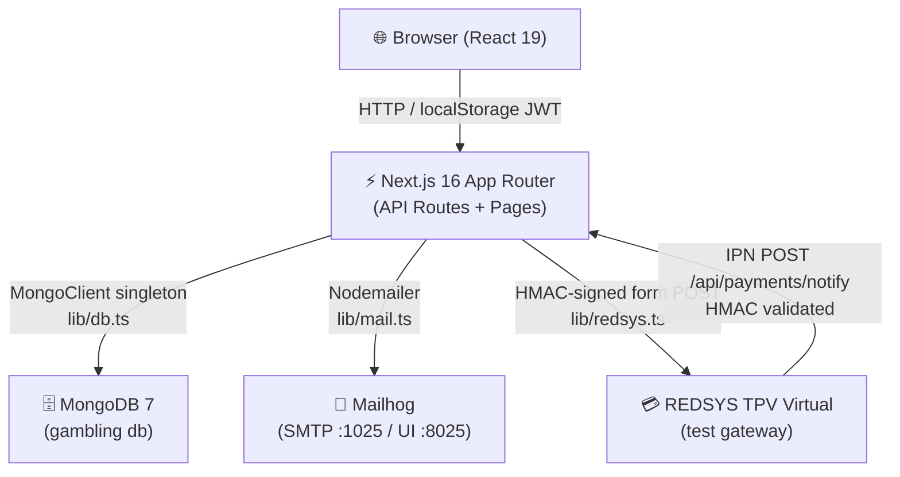
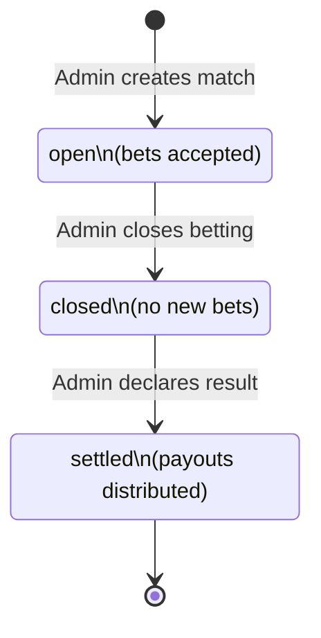
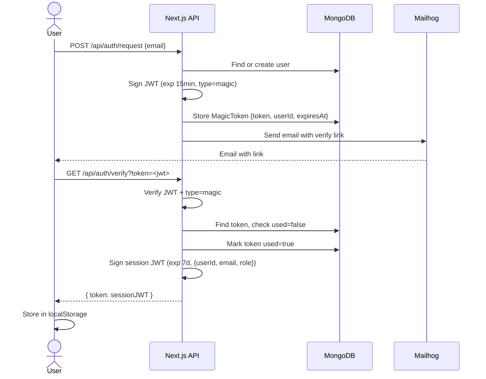
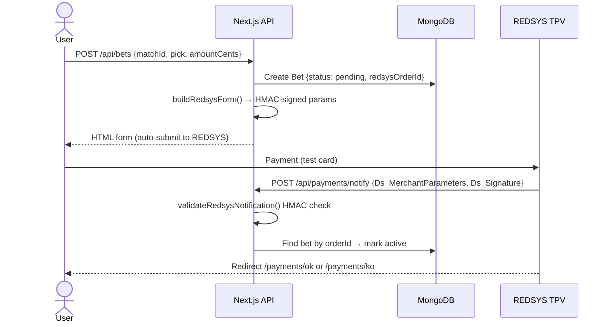
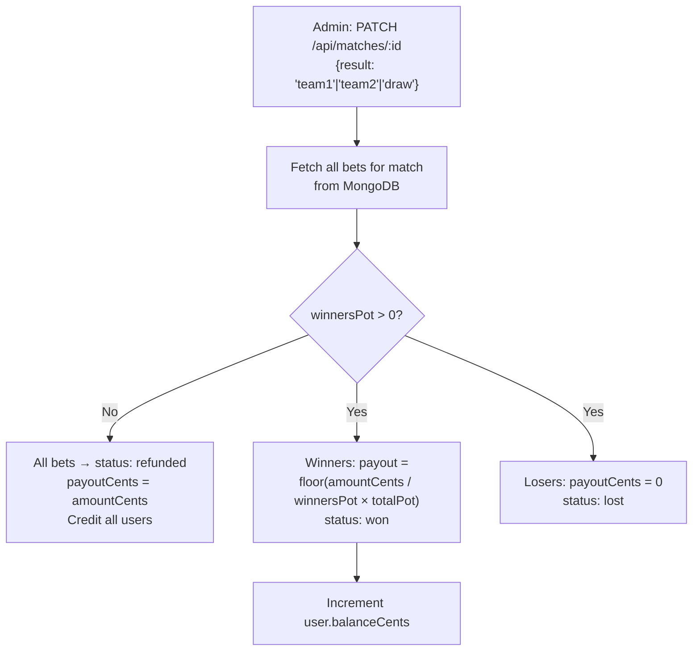

# Architecture — Sports Betting System

## System Overview



## Match Lifecycle State Machine



## Authentication Flow (Magic Link)



## Bet & Payment Flow (REDSYS)



## Payout Algorithm



## Layer Diagram

```
┌─────────────────────────────────────────────────┐
│                  Browser / UI                    │
│   React pages · AppContext · localStorage JWT    │
└───────────────────────┬─────────────────────────┘
                        │ HTTP fetch + Auth header
┌───────────────────────▼─────────────────────────┐
│              Next.js API Routes (app/api/)        │
│  /auth/request  /auth/verify  /matches  /bets    │
│  /payments/notify  /admin/users  /admin/reports  │
└────┬──────────────┬──────────────┬──────────────┘
     │              │              │
┌────▼────┐   ┌─────▼─────┐  ┌───▼──────────┐
│  lib/   │   │  lib/     │  │  lib/        │
│  auth   │   │  payout   │  │  redsys      │
│  (JWT)  │   │  (settle) │  │  (HMAC form) │
└────┬────┘   └─────┬─────┘  └──────────────┘
     │              │
┌────▼──────────────▼─────────────────────────────┐
│             lib/db.ts  (MongoDB Singleton)        │
│         MongoClient · gambling database          │
│   users · matches · bets · magic_tokens          │
└─────────────────────────────────────────────────┘
```

## Collections & Key Indexes

| Collection | Key Indexes |
|---|---|
| `users` | `{ email: 1, unique: true }` |
| `matches` | `{ status: 1 }` |
| `bets` | `{ matchId: 1 }`, `{ userId: 1 }`, `{ redsysOrderId: 1, unique: true }` |
| `magic_tokens` | `{ token: 1, unique: true }`, TTL on `expiresAt` |
